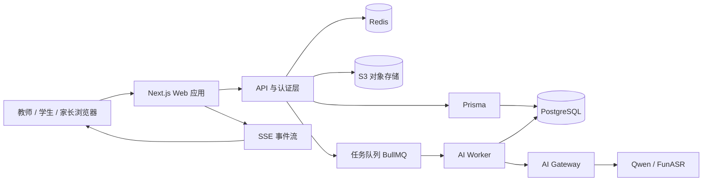
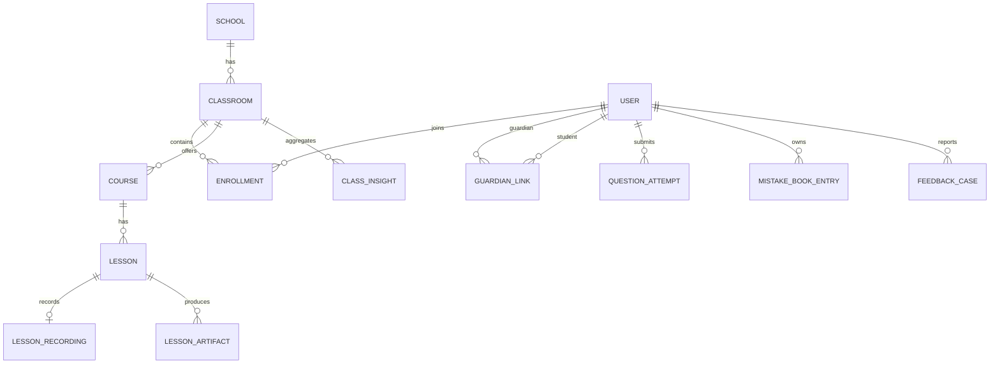

# 知野——技术规范文档（SPEC）

> 对应产品文档：[知野--PRD.md](../知野--PRD.md)。本文规定第一版 Web 平台的技术边界、数据契约与接口约定；所有儿童数据与 AI 输出均以最小留存、可追溯和人工确认优先为原则。

| 项目 | 决策 |
| --- | --- |
| 前端 | Next.js（App Router）+ TypeScript + Tailwind CSS |
| 后端 | Next.js Route Handlers + Server Actions；复杂异步任务由独立 Worker 执行 |
| 数据库 | PostgreSQL（生产）；SQLite（本地单机开发） |
| 数据访问 | Prisma ORM + Prisma Migrate |
| 缓存/队列 | Redis + BullMQ |
| 文件 | S3 兼容对象存储；客户端直传使用预签名 URL |
| 实时通知 | Server-Sent Events（SSE）；消息推送可扩展 WebSocket |
| 认证 | Auth.js + 邀请码/绑定码；HttpOnly 会话 Cookie |
| AI | 统一 AI Gateway，适配 Qwen3、Qwen3-Omni、FunASR；所有 AI 任务异步化 |
| 部署 | Docker Compose（试点）→ 托管 PostgreSQL/Redis/对象存储（推广） |

---

## 1. 系统架构

### 1.1 总体架构



### 1.2 组件职责

| 组件 | 职责 |
| --- | --- |
| Next.js Web | 三端页面、离线队列、上传、表单校验、角色路由与可访问性界面 |
| API 层 | REST 接口、身份校验、RBAC/监护关系校验、输入验证、审计记录 |
| PostgreSQL | 用户、班级、课程、学习事实、消息、审核状态与审计数据的唯一事实来源 |
| 对象存储 | 加密保存题图、课堂音频、导出文件；数据库只保存元数据与对象键 |
| Redis/BullMQ | 课堂转写、复盘生成、题图识别、摘要生成、通知等耗时任务的排队与重试 |
| AI Worker/Gateway | 脱敏后调用模型、结构化校验、置信度处理、写回草稿和任务状态 |

### 1.3 关键数据流

**课堂复盘**：教师上传音频 → 创建 `AIJob` → Worker 转写与分析 → 写入课堂报告、复习卡草稿和课程进度建议 → SSE 通知教师 → 教师编辑并发布。原始音频在确认发布后 7 天由定时任务删除。

**拍照答疑**：学生创建上传会话并直传题图 → 提交卡点说明 → Worker OCR/解题 → 根据卡点返回分层提示 → 记录学习事件 → 用户完成复述或练习后写入错题本与班级聚合指标。

**弱网同步**：前端 IndexedDB 加密保存待上传文件与可重放请求；联网后按幂等键顺序提交。服务端对同一 `idempotencyKey` 只处理一次。

---

## 2. 技术选型说明

### 2.1 为什么选 Next.js + TypeScript

- 同一项目内完成页面、服务端接口和认证，适合小团队快速交付。
- TypeScript 让角色、权限、任务状态、AI 结构化结果在编译期可校验，减少儿童数据误展示风险。
- App Router 支持服务端渲染、流式界面与渐进式 Web App，适合弱网下的快速首屏与离线缓存。

### 2.2 Prisma 是什么，为什么使用它

**Prisma 是 TypeScript/Node.js 的 ORM（对象关系映射工具）**。它用一份 `schema.prisma` 描述数据表、字段和表之间的关系，再自动生成带类型提示的数据库访问代码与迁移文件。

例如，不需要手写 SQL 拼接字符串，而以类型安全的方式查询“某教师可访问的班级”。它的作用包括：

- 将数据库表结构集中定义并版本化；
- 通过 `prisma migrate` 安全创建、升级表结构；
- 通过 `Prisma Client` 查询/写入数据并获得 TypeScript 类型检查；
- 本地可接 SQLite，生产切换 PostgreSQL 时保持大部分业务代码不变。

Prisma 不是数据库，也不替代权限校验：权限必须在 API 服务层显式判断，不能因为能查询到数据就允许返回给用户。

### 2.3 AI 接入原则

- 浏览器绝不保存模型密钥，也不直接调用模型。
- 所有模型请求经 AI Gateway，统一执行输入去标识化、速率限制、结构化输出校验、内容安全与失败降级。
- AI 生成结果使用 Zod Schema 校验；不合格结果转为 `needs_review`，不得直接发布。
- 课堂分析、题图识别、学习摘要为异步队列任务；客户端始终显示真实状态。

---

## 3. 数据模型

### 3.1 通用约定

- 主键统一为 `uuid`；所有时间为 `timestamptz`；金额无此版本需求。
- 除明确注明外，业务表包含 `createdAt timestamptz`、`updatedAt timestamptz`。
- 敏感文本和对象存储密钥使用应用层信封加密；日志不得写入题目图片、课堂原文或高风险反馈正文。
- 枚举在 Prisma 中定义；以下字段类型采用 PostgreSQL 表示法。

### 3.2 身份与组织

#### `User`

| 字段 | 类型 | 说明 |
| --- | --- | --- |
| id | uuid PK | 用户 ID |
| phone | varchar(32) unique nullable | 绑定手机号；可为空以支持学校公共账号流程 |
| displayName | varchar(64) | 显示姓名 |
| role | enum | `ADMIN`、`TEACHER`、`STUDENT`、`GUARDIAN`、`SAFEGUARDING_OFFICER` |
| avatarKey | varchar(512) nullable | 头像对象键 |
| status | enum | `ACTIVE`、`PENDING`、`SUSPENDED` |
| lastLoginAt | timestamptz nullable | 最近登录时间 |

#### `School`、`Classroom`、`Enrollment`、`GuardianLink`

| 表 | 关键字段 | 关系/约束 |
| --- | --- | --- |
| School | id, name, region, timezone, retentionDays int default 7 | 一个学校有多个班级 |
| Classroom | id, schoolId FK, name, grade int, inviteCodeHash, status | 唯一 `(schoolId, name, grade)` |
| Enrollment | id, classroomId FK, userId FK, roleInClass enum, studentNo nullable | 唯一 `(classroomId, userId)`；`roleInClass` 为教师或学生 |
| GuardianLink | id, guardianId FK User, studentId FK User, relation varchar(32), status | 唯一 `(guardianId, studentId)`；仅 `ACTIVE` 可读取摘要 |

#### `Invite`、`SafeguardingRouting`

| 表 | 关键字段 | 说明 |
| --- | --- | --- |
| Invite | id, classroomId FK nullable, role, codeHash, expiresAt, maxUses, usedCount | 教师/学生邀请码；仅存哈希，不存明文 |
| SafeguardingRouting | id, schoolId FK, officerId FK User, category enum, isActive | 学校按风险类别配置接收负责人 |

### 3.3 课堂、课程与 AI 草稿

#### `Course`、`Lesson`、`LessonRecording`

| 表 | 关键字段 | 说明 |
| --- | --- | --- |
| Course | id, classroomId FK, teacherId FK, subject enum, textbookVersion, unitName, currentProgress jsonb | 班级学科课程 |
| Lesson | id, courseId FK, teacherId FK, title, scheduledAt, status enum, publishedAt nullable | 一节课；状态 `DRAFT/PROCESSING/READY/PUBLISHED` |
| LessonRecording | id, lessonId FK, objectKey encrypted, durationSeconds, uploadStatus, deleteAfterAt, deletedAt nullable | 原音频元数据；不得永久保存 |

#### `LessonArtifact`、`LessonReport`

| 表 | 关键字段 | 说明 |
| --- | --- | --- |
| LessonArtifact | id, lessonId FK, type enum, content jsonb, version int, status enum, confirmedBy FK User nullable | `STUDENT_RECAP`、`PROGRESS_SUGGESTION`、`TEACHING_PLAN` 等；状态 `DRAFT/CONFIRMED/PUBLISHED/REJECTED` |
| LessonReport | id, lessonId FK unique, transcriptEncrypted text, report jsonb, confidence numeric(3,2), status enum | 教师私有课堂报告；报告内含依据、建议与不确定性 |

`content` 中的学生复习卡至少包含：`topic`、`keyPoints[]`、`commonMistakes[]`、`example`、`selfCheckQuestions[]`、`practiceDraft[]`。所有字段须由 Zod 校验。

### 3.4 学生学习与评测

#### `LearningEvent`、`QuestionAttempt`、`MistakeBookEntry`

| 表 | 关键字段 | 说明 |
| --- | --- | --- |
| LearningEvent | id, studentId FK, classroomId FK, type enum, subject, knowledgePoint, occurredAt, metadata jsonb | 不可变事实事件，如查看复习卡、完成练习、提交答疑 |
| QuestionAttempt | id, studentId FK, lessonId FK nullable, subject, imageKey encrypted nullable, promptEncrypted text nullable, stuckPoint enum, status enum, aiResponse jsonb, confidence numeric, idempotencyKey unique | 一次拍照/文字答疑；`stuckPoint` 为 `NO_IDEA/STUCK_STEP/CHECK_REASONING/CHECK_ANSWER` |
| MistakeBookEntry | id, studentId FK, questionAttemptId FK unique nullable, subject, knowledgePoint, occurredOn date, errorReason, mastery enum, noteEncrypted text nullable | 可由答疑生成或手动创建 |

#### `KnowledgeConversation`、`KnowledgeMessage`、`PracticeSet`、`PracticeSubmission`

| 表 | 关键字段 | 说明 |
| --- | --- | --- |
| KnowledgeConversation | id, studentId FK, subject, knowledgePoint, title, status | 知识点学习对话 |
| KnowledgeMessage | id, conversationId FK, sender enum, contentEncrypted text, attachments jsonb, confidence numeric nullable | 发送者为 `STUDENT/AI`；低置信度需带确认状态 |
| PracticeSet | id, classroomId FK nullable, teacherId FK nullable, lessonId FK nullable, title, source enum, questions jsonb, status enum, dueAt nullable | 来源 `AI_DRAFT/TEACHER_CREATED`；发布前 `CONFIRMED` |
| PracticeSubmission | id, practiceSetId FK, studentId FK, answers jsonb, score numeric nullable, knowledgeResults jsonb, submittedAt | 按知识点保存过程性结果 |

### 3.5 班级洞察、任务与沟通

#### `ClassInsight`、`Task`

| 表 | 关键字段 | 说明 |
| --- | --- | --- |
| ClassInsight | id, classroomId FK, courseId FK nullable, periodStart, periodEnd, knowledgePoint, stepLabel, affectedStudentCount int, evidence jsonb, confidence numeric, status | 热力图原子数据；不存排名字段 |
| Task | id, classroomId FK, teacherId FK, title, body, attachments jsonb, dueAt nullable, status | 教师发布的学习任务 |
| TaskCompletion | id, taskId FK, studentId FK, status, completedAt nullable, note | 唯一 `(taskId, studentId)` |

#### `Conversation`、`Message`、`Notification`

| 表 | 关键字段 | 说明 |
| --- | --- | --- |
| Conversation | id, type enum, classroomId FK nullable, createdBy FK User, status | `DIRECT/CLASS_GROUP`；学生私信仅允许本班教师 |
| ConversationMember | conversationId FK, userId FK, joinedAt, lastReadAt | 复合主键 `(conversationId, userId)` |
| Message | id, conversationId FK, senderId FK, bodyEncrypted text, attachments jsonb, sentAt, deliveryStatus | 普通消息不承载高风险反馈 |
| Notification | id, userId FK, type, payload jsonb, readAt nullable | 用于 SSE 推送和离线补拉 |

### 3.6 家长摘要、反馈、任务与审计

#### `ParentSummary`、`FeedbackCase`、`AIJob`、`AuditLog`

| 表 | 关键字段 | 说明 |
| --- | --- | --- |
| ParentSummary | id, studentId FK, periodStart, periodEnd, content jsonb, audioKey encrypted nullable, status, approvedBy FK User nullable | 仅 `PUBLISHED` 可被绑定监护人读取 |
| FeedbackCase | id, reporterId FK, classroomId FK nullable, category enum, riskLevel enum, contentEncrypted text, status enum, assignedTo FK User nullable | 普通反馈与高风险反馈；高风险不进入聊天表 |
| FeedbackAction | id, feedbackCaseId FK, actorId FK, action enum, noteEncrypted text, createdAt | 转交、查看、跟进、关闭等处置记录 |
| AIJob | id, type enum, requesterId FK, entityType, entityId uuid, payload jsonb, status enum, attempts int, errorCode nullable, idempotencyKey unique | `QUEUED/RUNNING/SUCCEEDED/FAILED/NEEDS_REVIEW` |
| AuditLog | id, actorId FK nullable, action, entityType, entityId, reason, ipHash, createdAt | 高风险访问、导出、权限变更等必须记录 |

### 3.7 主要关系



---

## 4. API 规范

### 4.1 通用约定

- 基础路径：`/api/v1`。
- 身份由 HttpOnly 会话 Cookie 提供；接口不得信任客户端传入的 `userId` 或 `role`。
- `Content-Type: application/json`；文件直传使用预签名 URL。
- 所有创建类、离线可重试请求支持 `Idempotency-Key` 请求头。
- 成功响应：`{ "data": ..., "meta": { "requestId": "uuid" } }`。
- 失败响应：`{ "error": { "code": "FORBIDDEN", "message": "无权访问该资源", "details": [] }, "meta": { "requestId": "uuid" } }`。
- 常用状态：`200/201/202/204`；参数错误 `400`；未登录 `401`；无权 `403`；不存在 `404`；冲突 `409`；限流 `429`。

### 4.2 认证、组织与账号

| 方法 | URL | 角色 | 说明 |
| --- | --- | --- | --- |
| POST | `/auth/send-code` | 公开 | 请求手机号验证码；限流 |
| POST | `/auth/verify-code` | 公开 | 验证并建立会话 |
| POST | `/auth/logout` | 登录用户 | 退出当前设备 |
| GET | `/me` | 登录用户 | 当前用户、角色与可访问班级 |
| POST | `/schools` | 平台/学校管理员 | 创建学校 |
| GET/PATCH | `/schools/:schoolId` | 学校管理员 | 查看/修改学校配置 |
| POST | `/schools/:schoolId/classrooms` | 学校管理员 | 创建班级 |
| GET | `/classrooms/:classroomId` | 班级成员 | 班级基础信息 |
| POST | `/invites` | 管理员/教师 | 创建教师或学生邀请码 |
| POST | `/invites/redeem` | 登录用户 | 使用邀请码入班 |
| POST | `/guardian-links` | 家长 | 使用绑定码建立监护关系 |
| PATCH | `/guardian-links/:id` | 管理员/家长 | 确认、解除或更正关系 |

### 4.3 课堂与备课

| 方法 | URL | 角色 | 说明 |
| --- | --- | --- | --- |
| POST | `/courses` | 教师 | 创建课程与课程进度 |
| GET/PATCH | `/courses/:courseId` | 授课教师 | 查看/更新课程 |
| POST | `/lessons` | 教师 | 创建一节课 |
| POST | `/lessons/:lessonId/upload-url` | 授课教师 | 获取课堂音频预签名上传地址 |
| POST | `/lessons/:lessonId/recordings` | 授课教师 | 上传完成后登记录音并创建分析任务，返回 `202` 与 `jobId` |
| GET | `/lessons/:lessonId` | 班级授权用户 | 读取课次信息；学生仅读已发布内容 |
| GET | `/lessons/:lessonId/report` | 授课教师 | 读取私有课堂报告 |
| PATCH | `/lesson-artifacts/:artifactId` | 授课教师 | 编辑 AI 草稿 |
| POST | `/lesson-artifacts/:artifactId/confirm` | 授课教师 | 确认草稿 |
| POST | `/lesson-artifacts/:artifactId/publish` | 授课教师 | 发布学生复习卡 |
| POST | `/ai/teaching-plans` | 教师 | 创建备课/补讲生成任务 |
| POST | `/practice-sets` | 教师 | 创建或保存 AI 题目草稿 |
| POST | `/practice-sets/:id/publish` | 教师 | 确认后发布练习/测试 |

### 4.4 学生学习与答疑

| 方法 | URL | 角色 | 说明 |
| --- | --- | --- | --- |
| GET | `/students/me/lessons` | 学生 | 获取已发布复习卡 |
| POST | `/uploads/presign` | 登录用户 | 获取题图/附件预签名上传地址；校验文件类型与大小 |
| POST | `/question-attempts` | 学生 | 提交题图键、学科、卡点类型和补充说明；返回 `202` 与 `jobId` |
| GET | `/question-attempts/:id` | 本人/授课教师 | 获取分层答疑结果；教师只读教学必要内容 |
| POST | `/question-attempts/:id/explain-back` | 学生 | 提交自我复述，生成下一步反馈 |
| POST | `/question-attempts/:id/variants` | 学生 | 请求同类巩固题 |
| GET/POST | `/mistake-book` | 学生 | 查询/手动创建错题 |
| PATCH/DELETE | `/mistake-book/:id` | 错题所属学生 | 更新/删除个人错题 |
| POST | `/knowledge-conversations` | 学生 | 创建知识点对话 |
| GET | `/knowledge-conversations` | 学生 | 获取个人对话列表 |
| POST | `/knowledge-conversations/:id/messages` | 学生 | 发送文字/语音问题；返回 AI 任务状态 |
| GET | `/knowledge-conversations/:id/messages` | 对话所属学生 | 获取历史消息 |
| POST | `/practice-sets/:id/submissions` | 学生 | 提交练习答案 |
| GET | `/students/me/portfolio` | 学生 | 读取自己的学习档案袋 |

### 4.5 洞察、任务、消息与家长摘要

| 方法 | URL | 角色 | 说明 |
| --- | --- | --- | --- |
| GET | `/classrooms/:id/insights` | 本班教师 | 获取热力图；参数含 `subject`、`period`、`knowledgePoint` |
| GET | `/students/:studentId/portfolio` | 授课教师/本人 | 读取权限过滤后的档案 |
| POST | `/tasks` | 教师 | 发布班级任务 |
| GET | `/tasks` | 班级成员 | 获取自己可见任务 |
| POST | `/tasks/:id/completions` | 学生 | 更新任务完成状态 |
| POST | `/conversations` | 班级成员 | 创建允许的私信或教师管理群组 |
| GET | `/conversations` | 登录用户 | 获取本人会话列表 |
| GET/POST | `/conversations/:id/messages` | 会话成员 | 获取/发送普通消息 |
| GET | `/guardians/me/summaries` | 家长 | 获取已发布的绑定学生摘要 |
| POST | `/parent-summaries/generate` | 教师/定时任务 | 创建家长摘要生成任务 |
| POST | `/parent-summaries/:id/publish` | 授课教师 | 审核并发布摘要 |

### 4.6 反馈、异步任务与实时事件

| 方法 | URL | 角色 | 说明 |
| --- | --- | --- | --- |
| POST | `/feedback-cases` | 学生/教师 | 创建独立反馈；服务端风险分流 |
| GET | `/feedback-cases` | 教师/负责人 | 普通反馈或本人被分配高风险事件；权限过滤 |
| POST | `/feedback-cases/:id/actions` | 有处置权限者 | 记录转交、跟进、关闭等动作 |
| GET | `/ai-jobs/:jobId` | 请求者/授权教师 | 获取任务状态、错误码和结果引用 |
| GET | `/events` | 登录用户 | SSE 订阅个人通知、任务状态与新消息 |

### 4.7 请求示例：提交拍照答疑

```json
POST /api/v1/question-attempts
Idempotency-Key: 4dc6e7c7-87ac-4f07-a537-17126c3fdbb3

{
  "subject": "MATH",
  "imageKey": "private/questions/2026/07/q-123.jpg",
  "stuckPoint": "STUCK_STEP",
  "prompt": "我会列式，但不知道下一步怎么计算"
}
```

```json
202 Accepted
{
  "data": {
    "attemptId": "a0cd9bf4-73bc-4e11-ae1d-c5aa64d6d120",
    "jobId": "7d607533-f57f-4a66-a0fb-00f5aa7e157c",
    "status": "QUEUED"
  },
  "meta": { "requestId": "..." }
}
```

---

## 5. 建议目录结构

```text
zhiye/
├── specs/
│   ├── SPEC.md
│   ├── ARCHITECTURE.md
│   └── API.md
├── prisma/
│   ├── schema.prisma
│   ├── migrations/
│   └── seed.ts
├── src/
│   ├── app/
│   │   ├── (auth)/
│   │   ├── (teacher)/teacher/
│   │   ├── (student)/student/
│   │   ├── (guardian)/guardian/
│   │   ├── (admin)/admin/
│   │   └── api/v1/
│   ├── components/
│   │   ├── ui/
│   │   ├── learning/
│   │   ├── classroom/
│   │   └── feedback/
│   ├── features/
│   │   ├── auth/
│   │   ├── classroom/
│   │   ├── learning/
│   │   ├── insights/
│   │   ├── messaging/
│   │   ├── safeguarding/
│   │   └── parent-summary/
│   ├── server/
│   │   ├── auth/
│   │   ├── db/
│   │   ├── permissions/
│   │   ├── ai/
│   │   ├── queues/
│   │   ├── storage/
│   │   └── validators/
│   ├── workers/
│   │   ├── lesson-analysis.worker.ts
│   │   ├── question-answer.worker.ts
│   │   ├── parent-summary.worker.ts
│   │   └── retention-cleanup.worker.ts
│   ├── lib/
│   └── types/
├── tests/
│   ├── unit/
│   ├── integration/
│   └── e2e/
├── public/
├── docker-compose.yml
├── .env.example
└── package.json
```

---

## 6. 质量规范

### 6.1 编码规范

- 全量 TypeScript，禁止 `any`；接口输入/输出使用 Zod Schema。
- React 组件用 PascalCase；函数、变量用 camelCase；数据库模型用 PascalCase，字段用 camelCase。
- 业务逻辑放在 `features/` 或 `server/`，Route Handler 只负责协议转换、认证与调用服务，不直接堆积业务逻辑。
- 不在客户端暴露密钥、对象存储永久地址、原始音频/敏感反馈正文。
- 每个影响权限、留存、AI 决策的函数需要说明输入、输出、授权前提与失败行为。

### 6.2 测试规范

| 层级 | 必测场景 |
| --- | --- |
| 单元测试 | RBAC 判定、监护关系判定、Zod 校验、AI 输出解析、风险分流、幂等去重、留存日期计算 |
| 集成测试 | Prisma 数据读写、API 认证授权、预签名上传、队列重试、课堂确认发布、反馈转交审计 |
| E2E 测试 | 教师课堂复盘发布、学生分层答疑到错题本、热力图到补讲、家长摘要、断网后同步、高风险反馈隔离 |
| 安全回归 | 学生越权读取他人档案、家长越权读取非绑定学生、教师跨班级访问、篡改对象键、重复请求 |

- 新功能至少包含正向、无权、参数错误与弱网/重复提交场景。
- 与儿童安全、高风险反馈、数据删除相关的逻辑必须有自动化回归测试。

### 6.3 安全规范

- 服务端每个资源读取都执行“学校—班级—角色—监护关系”校验；前端隐藏按钮不能替代后端鉴权。
- 上传接口校验 MIME 类型、文件大小、对象键前缀和所有权；下载使用短时预签名 URL。
- 对登录、验证码、AI 生成、消息和上传实施速率限制；记录异常但不记录敏感正文。
- 原始课堂音频按 `deleteAfterAt` 定时清除；删除失败必须告警并重试。
- 高风险反馈仅允许最小必要角色读取，所有访问和处置行为写入 `AuditLog`。

---

## 7. 实施前置条件

1. 学校明确课堂录音、儿童数据处理与高风险反馈的授权、告知和负责人制度。
2. 确定模型供应商、数据处理地域、对象存储与密钥管理方案。
3. 与试点教师共同确认数学教材版本、课堂报告评价维度和学生复习卡样式。
4. 在接入真实学生数据前，以脱敏样例完成权限、安全、弱网和 AI 结构化输出的端到端验证。
