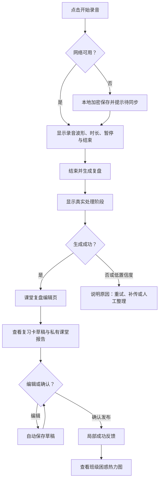
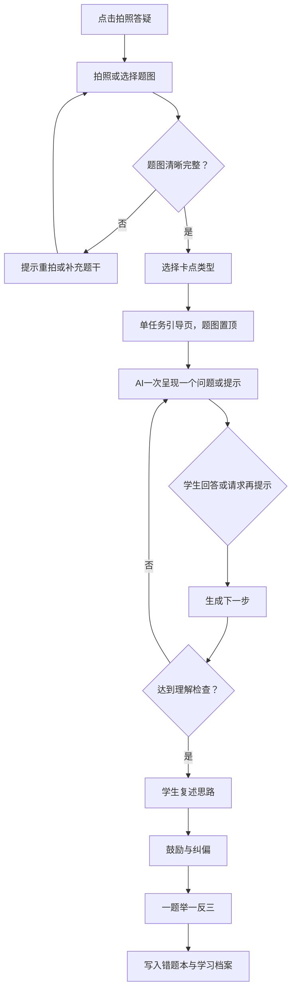
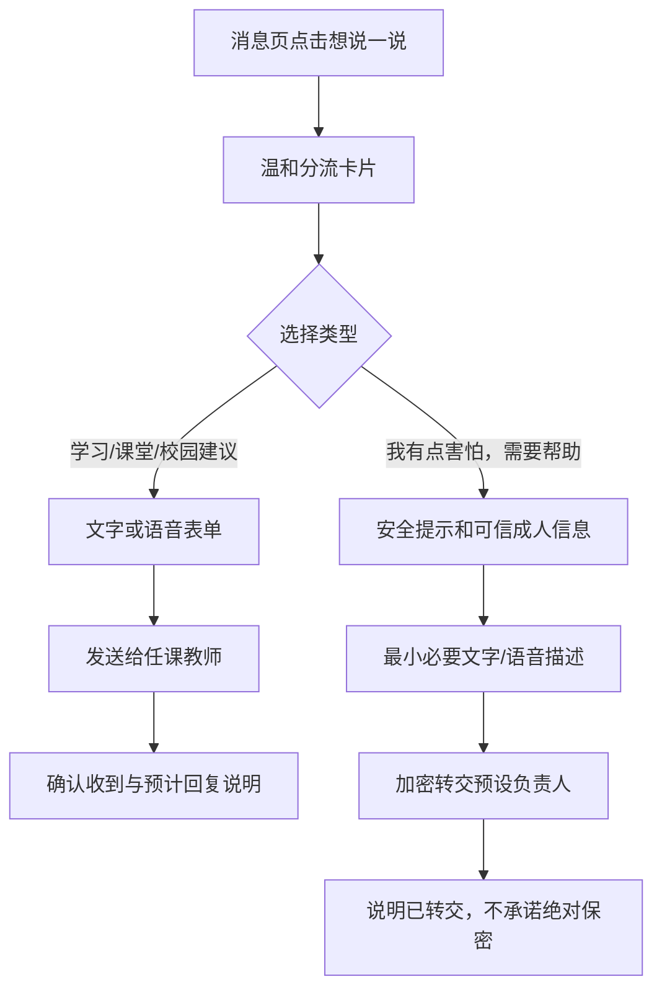

# 知野——UX & UI 规范文档

> 对应：[产品需求文档](../知野--PRD.md)｜[技术规范](SPEC.md)
>
> 设计目标：用克制、温暖、即时反馈的界面，让教师看见课堂后的真实困难，让孩子愿意一步步想明白，让家长得到不焦虑的支持信息。

---

## 1. 信息架构

### 1.1 页面层级

```text
知野
├─ 教师端
│  ├─ 首页：待确认课堂复盘；无待确认时显示班级困惑热力图
│  ├─ 课堂：录音、课次列表、课堂报告、复习卡确认与发布
│  ├─ 洞察：班级困惑热力图、学生档案、补讲建议
│  ├─ 备课与测验：教案、课件大纲、练习与测验
│  ├─ 消息：班级群、师生私信、家校私信、普通反馈
│  └─ 我的：账户、班级/学科、通知、设置
├─ 学生端
│  ├─ 首页：今日复习卡、待完成任务、学习鼓励
│  ├─ 答疑：拍题、单任务引导、复述、举一反三
│  ├─ 错题：错题本、知识卡、复习提醒
│  ├─ 消息：教师私信、班级群、“想说一说”
│  └─ 我的：档案袋、设置
├─ 家长端
│  ├─ 首页：学习陪伴摘要、老师留言、鼓励建议
│  ├─ 消息：与本班教师沟通
│  └─ 我的：绑定孩子、通知、设置
└─ 管理/保护端
   ├─ 学校与班级管理
   ├─ 邀请与绑定
   ├─ 高风险反馈处置台
   └─ 审计与数据留存设置
```

### 1.2 导航与响应式行为

| 场景 | 规范 |
| --- | --- |
| 教师桌面端（≥1200px） | 224px 固定左侧导航 + 自适应主内容区 + 320px 可收起右侧上下文栏 |
| 教师中等屏（768–1199px） | 保留左侧导航；右栏折叠为顶部“今日动态”入口 |
| 三端手机（<768px） | 底部主导航 + 顶部上下文；每端最多 5 个底部入口 |
| 手机教师端导航 | 首页、课堂、洞察、消息、我的 |
| 手机学生端导航 | 首页、答疑、错题、消息、我的 |
| 手机家长端导航 | 首页、消息、我的 |
| 低频操作 | 使用从触发源展开的底部抽屉或浮层；不占用底部主导航 |

### 1.3 内容优先级

- 教师首页首要内容是“待确认课堂复盘”；当没有待确认内容时，替换为班级困惑热力图和生成补讲建议。
- 学生首页首要内容是当天教师发布的复习卡和待完成任务；拍照答疑始终作为显著快捷入口。
- 家长首页仅显示有解释的学习陪伴摘要，不显示排名、同学对比、完整聊天记录或未经解释的自动评价。
- 一屏只设置一个明确主操作，例如“确认并发布”“我想到了”“提交反馈”。

---

## 2. 核心用户流程

### 2.1 教师课堂复盘与发布



**状态与恢复**

- 录音中：只展示大号计时、波形、暂停/结束；结束录音需二次确认。
- 处理中：显示“已上传 / 正在转写 / 正在整理复习卡 / 等待确认”等真实阶段，不显示虚假百分比。
- 编辑页：左侧学生复习卡，右侧教师私有报告；发布按钮固定在页底。
- 发布后：不自动跳走，显示“已发布”，并提供“查看学生视图”“查看困难热力图”。
- 离线：顶部窄提示条；用户仍可录音、编辑和保存草稿。

### 2.2 学生单任务答疑



- 先选择“完全没思路 / 卡在某一步 / 核对思路 / 检查答案”，再开始 AI 引导。
- 当前步骤未完成时，不能直接跳转至最终答案；可展开“已完成步骤”回看。
- 连续高频直接求助时，以温和卡片引导学生描述已经尝试过的办法，不进行惩罚性封禁。

### 2.3 学生保护性反馈



- 首屏使用儿童可理解的分类与图标，避免“举报”“高风险”等成人化术语。
- 高风险路径不使用 AI 连续追问；允许语音输入，且不强制填写非必要个人信息。
- 断网时加密保存草稿并显示“尚未发送”，不制造已送达的错觉。

---

## 3. 关键视图规范

### 3.1 教师桌面首页

```text
┌──────────────────┬──────────────────────────────────┬────────────────────┐
│ 知野             │ 五年级（2）班 · 数学             │ 今日动态           │
│ ● 首页           │ 早上好，李老师                    │ 3 个待完成任务     │
│   课堂           │ 先完成这一节课堂复盘              │ 2 条新消息         │
│   洞察           │ ┌──────────────────────────────┐ │ 班级困惑摘要       │
│   备课与测验     │ │ 分数的基本性质                  │ │ 单位换算 ↑        │
│   消息           │ │ 已转写 · 复习卡待确认          │ │ 约分步骤 ↑        │
│                  │ │ [查看并确认]                  │ │ [查看完整热力图]  │
│ 设置 / 退出      │ └──────────────────────────────┘ │                    │
└──────────────────┴──────────────────────────────────┴────────────────────┘
```

- 左栏固定 224px；当前页使用浅松绿胶囊高亮。
- 中栏显示单张“待确认课堂复盘”大卡；无待确认内容时替换为热力图和补讲操作。
- 右栏仅呈现时间敏感、可行动信息；不承载完整课堂报告。
- 首次使用显示“创建班级 / 开始第一节课堂”两步引导；加载失败显示原因与“重试 / 查看本地草稿”。

### 3.2 教师课堂复盘编辑页

```text
┌────────── 返回课堂 ────────── 分数的基本性质 ────────── 已自动保存 ┐
│ ┌──────────────────────────┐  ┌────────────────────────────────┐ │
│ │ 学生复习卡（可编辑）      │  │ 教师课堂报告（仅教师可见）      │ │
│ │ 本节学到了什么             │  │ 节奏、互动、难点依据、建议      │ │
│ └──────────────────────────┘  └────────────────────────────────┘ │
│ [保存草稿]                                      [确认并发布给学生] │
└────────────────────────────────────────────────────────────────────┘
```

- 使用 6:4 双栏；学生可见内容与教师私有分析在视觉上清晰区分。
- 每个 AI 内容块提供“依据”“重新生成”“编辑”，而非整页聊天记录。
- 发布前使用极简确认浮层，明确“学生将看到左侧内容”。

### 3.3 学生单任务答疑页

```text
┌──────────────────────────────┐
│ ← 拍照答疑         第 2 / 4 步 │
│ ┌──────────────────────────┐ │
│ │          题目图片          │ │
│ └──────────────────────────┘ │
│ 你已经找到两个已知条件。       │
│ 题目最后要我们求什么？         │
│ [我想到了]                    │
│ [再提示一点]                  │
│ 已完成步骤 ︿                  │
└──────────────────────────────┘
```

- 题图占顶部约 30%，点击可全屏查看；当前问题使用 22–24px 字号。
- “我想到了”为全宽主按钮；“再提示一点”为次操作；触达最终答案必须满足前置步骤。
- 进度仅表示完成步骤，不表示分数或比较。

### 3.4 学生“想说一说”页

- 顶部文案：“有些事说出来，会有人帮你一起想。”
- 四张等高整卡选择项：学习上有点难、对课堂有想法、学校里遇到的事、我有点害怕需要帮助。
- “需要帮助”使用温和浅紫/暖金边框，禁止使用警示红色；后续页面显示可信成人与紧急求助信息。
- 语音交互为按住说话，松开后可重听、删除、重录。

### 3.5 家长学习陪伴摘要页

- 顺序：本周学到什么 → 孩子主动完成的事 → 一条鼓励建议 → 教师留言 → 联系老师。
- 支持 60–90 秒语音学习家书；慢网下优先显示文字摘要与下载状态。
- 每张数据卡提供“这是什么意思？”说明入口，避免家长误读学习行为次数。

---

## 4. 交互模式

### 4.1 操作与反馈

| 层级 | 样式与行为 |
| --- | --- |
| 主操作 | 深松绿实心、白字、至少 48px 高，如“确认并发布”“我想到了” |
| 次操作 | 透明/暖白底、松绿描边或文字，如“保存草稿”“再提示一点” |
| 破坏性操作 | 文本按钮或二次确认浮层，不以高饱和红色抢夺注意力 |
| 低频操作 | 图标按钮加无障碍标签；首次使用显示文字说明 |

- 按下瞬间缩放至约 `0.97`，松开后平滑恢复。
- 成功时只更新相关卡片，不以全页跳转或夸张庆祝打断工作流。
- 长文本编辑使用全屏页；上传、筛选、快捷操作使用底部抽屉。
- 不可逆操作才二次确认；普通编辑自动保存并提供短暂撤销提示。

### 4.2 AI 与离线状态

| 状态 | 可视反馈 | 可用操作 |
| --- | --- | --- |
| 待同步 | 原操作卡保留，标注“将在联网后发送” | 继续使用、手动重试、查看队列 |
| 排队中 | 阶段标签与轻量脉冲 | 离开页面，后台继续 |
| 处理中 | 显示真实处理阶段 | 取消非敏感生成、查看原始输入 |
| 需补充 | 明确缺失项 | 重拍、补充文字、暂存草稿 |
| 低置信度 | “我可能没看清/听清” | 确认转写、重录、询问教师 |
| 成功 | 局部完成状态与下一步 | 查看结果、继续任务 |
| 失败 | 可理解原因 | 重试、保留草稿、转人工 |

### 4.3 动效与手势

- 页面切换只使用短 `opacity + transform` 过渡；浮层和抽屉从触发源附近进入、沿原路径退出。
- 手势驱动的抽屉和图片浏览使用可打断弹簧；普通菜单与加载不使用弹跳。
- 默认无过冲；只有用户甩动/拖动产生动量时允许极轻回弹。
- 减少动态效果时，所有位移和回弹退化为 150–200ms 淡入淡出；减少透明度时，将半透明工具层切为实色。
- 抽屉拖动阈值约 10px，并始终提供明确关闭按钮；核心功能不能仅依赖手势。

---

## 5. 设计系统

### 5.1 字体、栅格与间距

- 系统字体栈：`-apple-system, BlinkMacSystemFont, "SF Pro Display", "PingFang SC", "Microsoft YaHei", sans-serif`。
- 教师桌面端为 12 列栅格，外边距 32px、沟槽 24px、最大内容宽度 1440px。
- 手机端单列，内边距 16px、卡片间距 12px，需预留底部安全区。
- 统一 4px 基准间距：`4 / 8 / 12 / 16 / 24 / 32 / 48 / 64`。

### 5.2 颜色与表面令牌

| 令牌 | 色值 | 用途 |
| --- | --- | --- |
| `--bg-canvas` | `#F7F6F1` | 暖白页面背景 |
| `--text-primary` | `#1B2420` | 主文字 |
| `--text-secondary` | `#66706A` | 辅助文字 |
| `--brand-forest` | `#285943` | 主操作、当前导航、关键链接 |
| `--accent-grain` | `#C79035` | 进度、完成与温和提醒 |
| `--surface` | `rgba(255,255,255,.72)` | 轻透明信息表面 |
| `--danger` | `#B64747` | 明确错误与删除确认 |

- 卡片圆角 20px；按钮 14px；输入框 12px；图标按钮全圆。
- 普通卡片依靠背景层次而非重阴影；阴影仅用于工具栏、抽屉和弹窗。
- 深色模式通过语义令牌统一切换，禁止在单个组件内散落深色覆写。

---

## 6. 可访问性

- 达到 WCAG 2.1 AA：正文至少 4.5:1 对比度，大文字至少 3:1；颜色不能是唯一状态信息。
- 所有可点区域至少 44×44px，学生主按钮至少 48px 高。
- 键盘顺序：跳至主内容 → 侧边导航 → 页面主操作 → 右侧上下文 → 页底操作；弹窗/抽屉需焦点锁定并在关闭后返回触发按钮。
- 图标按钮必须有可读标签；题图、热力图、录音波形均提供文字摘要或等价数据。
- 表单错误用 `aria-describedby` 关联；AI 状态更新使用非打断式 `aria-live="polite"`。
- 支持深色、减少动态效果、减少透明度与增强对比度的系统偏好。

---

## 7. 前端实现映射

| UX 单元 | 建议组件 | 实现重点 |
| --- | --- | --- |
| 三端壳层 | `AppShell`、`DesktopSidebar`、`MobileTabBar` | 路由决定角色布局；服务端重复校验权限 |
| 教师首页 | `TeacherDashboard`、`PendingLessonCard`、`InsightSummary` | Server Component 首屏；SSE/React Query 局部更新 |
| 课堂复盘 | `LessonReviewEditor`、`ArtifactEditor`、`ReportPanel` | 草稿防抖保存；发布后由服务端确认 |
| 单任务答疑 | `QuestionFlow`、`QuestionImageViewer`、`StepPrompt` | 有限状态机控制步骤，不能客户端跳关 |
| 上传与弱网 | `UploadSheet`、`SyncStatus`、`OfflineQueue` | IndexedDB 加密队列、幂等键、联网顺序重放 |
| 保护性反馈 | `FeedbackRouter`、`SafeHelpPanel` | 风险分流只在服务端；界面不泄露负责人私人信息 |
| AI 状态 | `JobStatusChip`、`AiDraftBadge` | SSE 为主、轮询兜底，文案来自统一状态映射 |
| 抽屉与动效 | `BottomSheet`、`MotionSurface` | Motion/Framer Motion；可中断，减少动态时降级 |

### 7.1 前端验收要点

- 慢网下先渲染页面骨架，不等待 AI 数据。
- 课堂音频/题图经预签名地址直传对象存储，不经过应用服务器。
- 热力图只读取服务端聚合结果，禁止把全量学生事件下载到浏览器计算。
- 图片使用压缩预览和按需加载；长列表使用分页或虚拟滚动。
- 公共设备退出、重新登录与离线草稿清理/同步必须有明确提示。

